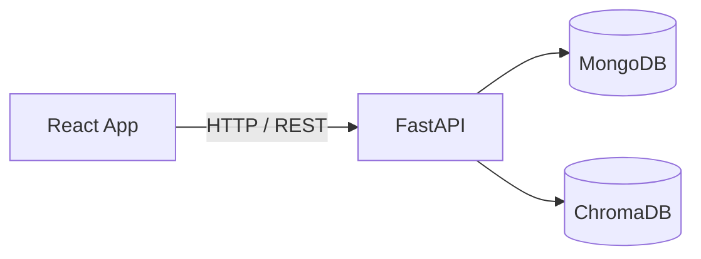

# Memento

**Trabajo de Fin de Grado** — Grado en Ingeniería Informática, mención en Computación  
Universidade da Coruña (UDC)


Memento es una plataforma web que permite a los usuarios procesar grabaciones de reuniones: sube un archivo de audio y obtiene automáticamente su transcripción y un resumen estructurado. Además, cuenta con un asistente conversacional basado en RAG (*Retrieval-Augmented Generation*) al que se pueden hacer preguntas sobre el contenido tratado en las reuniones.

Todo el procesamiento puede realizarse de forma completamente local mediante **WhisperX** para la transcripción y **Ollama** para los modelos de lenguaje. También existe la posibilidad de añadir *API keys* externas: **AssemblyAI** para la transcripción, y **OpenAI** o **Anthropic** para el asistente conversacional y la generación de resúmenes.

---

## Funcionalidades

- **Subida y transcripción automática**: Arrastra uno o varios archivos de audio. WhisperX (o AssemblyAI) los transcribe con detección de hablantes (*diarization*).

  

- **Resúmenes estructurados**: Cada reunión genera un resumen automático con el contenido más relevante.

  

- **Asistente conversacional con RAG**: Realiza preguntas en lenguaje natural sobre tus reuniones. El asistente usa los resúmenes como contexto para responder.

  

- **Soporte multi-proveedor**: Elige entre Ollama (local), OpenAI o Anthropic para el chat y los resúmenes. Para transcripción, WhisperX (local) o AssemblyAI (cloud).

- **Interfaz responsive**: Tema claro/oscuro automático, internacionalización (i18n) y configuración personalizable.

---

## Tecnologías

| Capa | Tecnologías |
|------|------------|
| Frontend | React, TypeScript, Vite, Tailwind CSS, Zustand, TanStack Query, React Router |
| Backend | Python, FastAPI, Uvicorn, Pydantic, LangChain |
| Bases de datos | MongoDB (documentos), ChromaDB (vectores) |
| Transcripción | WhisperX, Faster-Whisper, PyAnnote Audio, AssemblyAI |
| Modelos de lenguaje | Ollama (local), OpenAI, Anthropic |
| Infraestructura | Docker Compose, NVIDIA CUDA, Nginx Proxy Manager |

---

## Arquitectura



El cliente web (React) se comunica con la API REST (FastAPI). Los audios se procesan mediante WhisperX (local con GPU) o AssemblyAI (cloud). Los resúmenes y el asistente conversacional utilizan RAG sobre ChromaDB, con el modelo de lenguaje elegido por el usuario (Ollama, OpenAI o Anthropic). Los datos persistentes se almacenan en MongoDB.

---

## Documentación

- [Manual de usuario](docs/manual/manual-de-usuario.md): Guía completa de uso de la aplicación.
- [Guía de instalación](docs/guia_instalacion/guia-instalacion.md): Instalación, configuración y despliegue paso a paso.
- [Memoria del TFG](docs/memoria-tfg.pdf): Documento completo del trabajo fin de grado.

---

## Estructura del proyecto

```
├── Backend/
│   ├── app/              # API (FastAPI)
│   ├── tests/            # Tests unitarios y de integración
│   └── Dockerfile
├── Frontend/
│   ├── src/              # Aplicación React
│   ├── tests/            # Tests unitarios y de integración
│   └── Dockerfile
├── docs/
│   ├── manual/           # Manual de usuario
│   ├── guia_instalacion/ # Guía de instalación
│   ├── diagrams/         # Diagramas PlantUML y Excalidraw
│   └── memoria-tfg.pdf   # Memoria del TFG
├── scripts/              # Utilidades
├── docker-compose.yaml   # Orquestación de servicios
└── README.md
```
