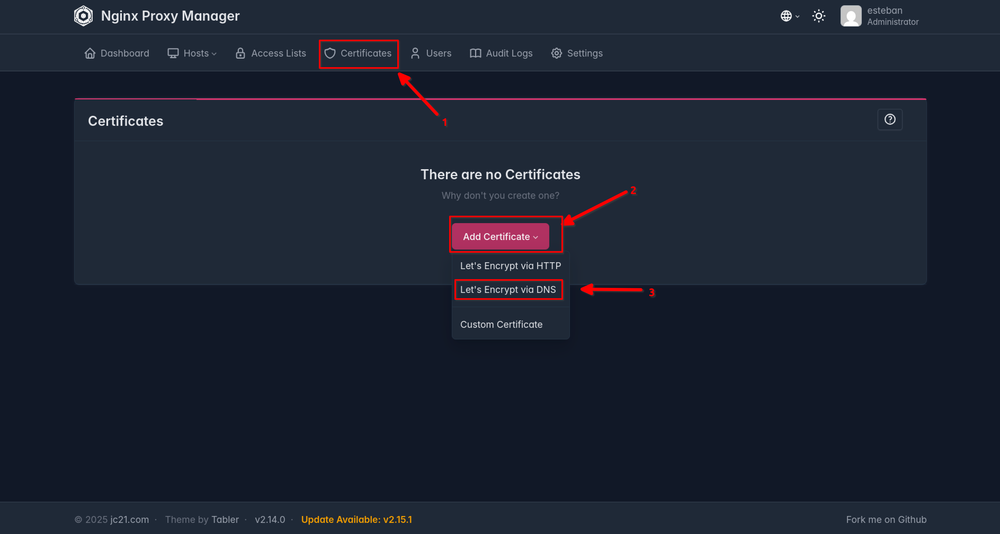
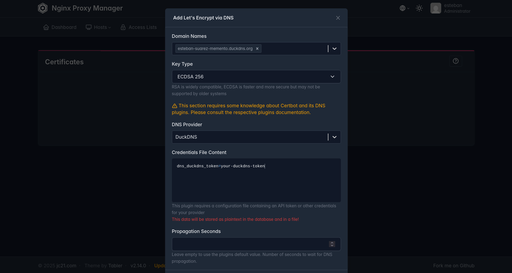
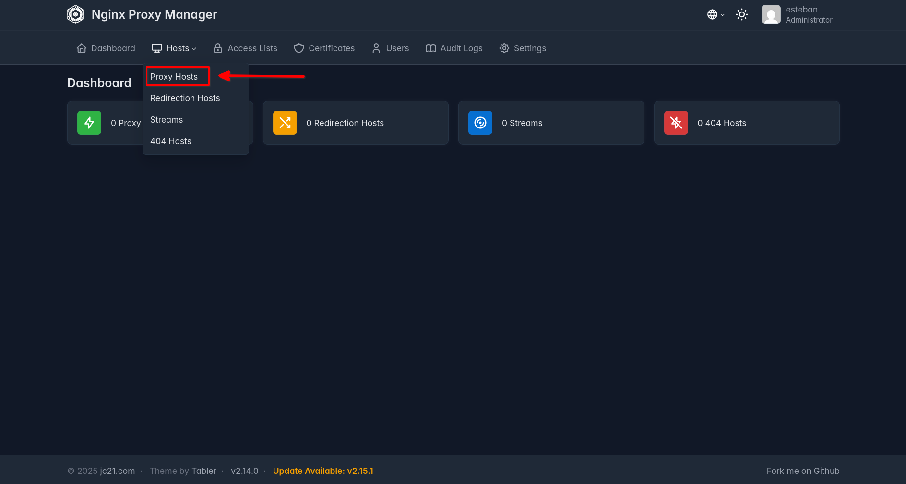
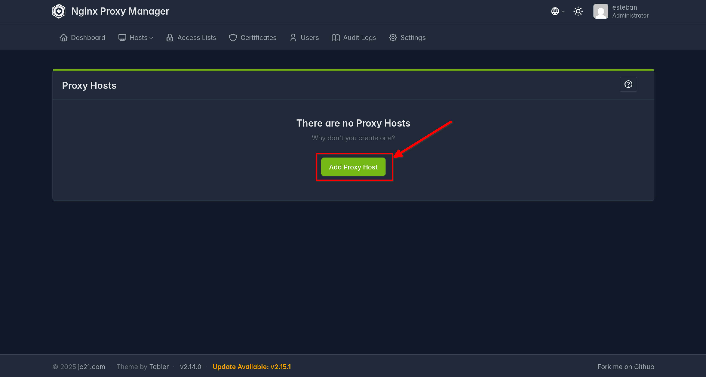
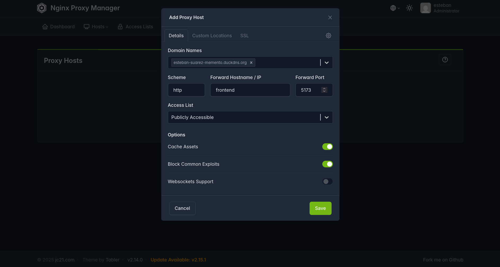
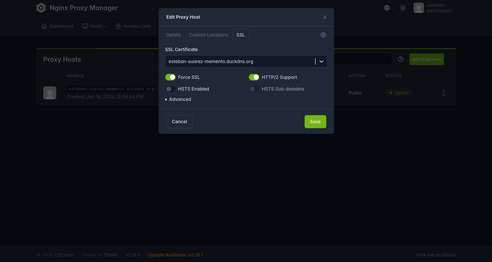

Esta guía describe paso a paso cómo instalar y desplegar Memento, desde la configuración inicial del sistema hasta la puesta en marcha con dominio público y certificado SSL.

## Índice

- [Índice](#índice)
- [1. Requisitos del sistema](#1-requisitos-del-sistema)
  - [1.1 Hardware](#11-hardware)
  - [1.2 Software](#12-software)
- [2. Instalación de prerrequisitos](#2-instalación-de-prerrequisitos)
  - [2.1 Docker](#21-docker)
  - [2.2 NVIDIA Container Toolkit](#22-nvidia-container-toolkit)
  - [2.3 Verificar instalación](#23-verificar-instalación)
- [3. Configuración del proyecto](#3-configuración-del-proyecto)
  - [3.1 Clonar el repositorio](#31-clonar-el-repositorio)
  - [3.2 Archivos de entorno](#32-archivos-de-entorno)
- [4. Despliegue](#4-despliegue)
  - [Verificar estado](#verificar-estado)
- [5. Acceso a la aplicación](#5-acceso-a-la-aplicación)
  - [Primer uso](#primer-uso)
- [6. Dominio y acceso seguro (DuckDNS + Nginx Proxy Manager)](#6-dominio-y-acceso-seguro-duckdns--nginx-proxy-manager)
  - [6.1 Obtener un subdominio en DuckDNS](#61-obtener-un-subdominio-en-duckdns)
  - [6.2 Verificar que el dominio resuelve](#62-verificar-que-el-dominio-resuelve)
  - [6.3 Configurar el dominio en el proyecto](#63-configurar-el-dominio-en-el-proyecto)
  - [6.4 Crear el certificado SSL](#64-crear-el-certificado-ssl)
  - [6.5 Crear el Proxy Host](#65-crear-el-proxy-host)
  - [6.6 Verificar el acceso HTTPS](#66-verificar-el-acceso-https)
  - [6.7 NAT loopback (acceso desde la misma red)](#67-nat-loopback-acceso-desde-la-misma-red)
- [7. Configuración de APIs externas (opcional)](#7-configuración-de-apis-externas-opcional)
- [8. Comandos útiles](#8-comandos-útiles)

## 1. Requisitos del sistema

### 1.1 Hardware

Los requisitos de hardware mínimos son los siguientes:

- **GPU NVIDIA:** 4 GB de VRAM mínimo (para usar Ollama local).
- **RAM:** 16 GB.
- **Almacenamiento:** ~30 GB disponibles (imágenes Docker + modelos).

Si tu GPU tiene menos de 4 GB de VRAM, puedes usar APIs externas (OpenAI o Anthropic) en lugar de Ollama local. Esta alternativa se explica en la sección 7.

### 1.2 Software

- **Sistema Operativo:** Ubuntu 25.10.
- **CUDA:** 12.8.
- **Docker:** 29.1.5 o superior.
- **Docker Compose:** 2.0 o superior.
- **NVIDIA Container Toolkit.**

## 2. Instalación de prerrequisitos

### 2.1 Docker

```bash
sudo apt-get update
sudo apt-get install -y docker.io docker-compose-v2
sudo usermod -aG docker $USER
newgrp docker
```

### 2.2 NVIDIA Container Toolkit

Permite a los contenedores Docker acceder a la GPU NVIDIA.

```bash
curl -fsSL https://nvidia.github.io/libnvidia-container/gpgkey \
  | sudo gpg --dearmor -o /usr/share/keyrings/nvidia-container-toolkit-keyring.gpg

curl -s -L https://nvidia.github.io/libnvidia-container/stable/deb/nvidia-container-toolkit.list \
  | sed 's#deb https://#deb [signed-by=/usr/share/keyrings/nvidia-container-toolkit-keyring.gpg] https://#g' \
  | sudo tee /etc/apt/sources.list.d/nvidia-container-toolkit.list

sudo apt-get update
sudo apt-get install -y nvidia-container-toolkit
sudo nvidia-ctk runtime configure --runtime=docker
sudo systemctl restart docker
```

### 2.3 Verificar instalación

```bash
nvidia-smi
docker run --rm --runtime=nvidia --gpus all nvidia/cuda:12.8.0-base-ubuntu22.04 nvidia-smi
```

Si ambos comandos muestran información de la GPU, la instalación es correcta.

## 3. Configuración del proyecto

### 3.1 Clonar el repositorio

```bash
git clone git@github.com:estebansuarezcalvoudc/Memento.git
cd memento
```

### 3.2 Archivos de entorno

El proyecto usa dos archivos `.env`.

**.env (raíz del proyecto)**

Crea un fichero denominado `.env` en la raíz del proyecto:

```bash
touch .env
```

Edítalo dando valores a las siguientes variables:

```bash
FRONTEND_PORT=5173
BACKEND_PORT=8000

MONGO_HOST=mongo_db
MONGO_USER=mongo
MONGO_PASSWORD=mongo
MONGO_PORT=27017

OLLAMA_HOST=ollama
OLLAMA_PORT=11434

CHROMA_HOST=chromadb
CHROMA_PORT=8000
RAG_EMBEDDING_MODEL=nomic-embed-text
RAG_COLLECTION_NAME=meetings

DOMAIN=localhost
```

Cambia `MONGO_USER` y `MONGO_PASSWORD` en producción.

**Backend/.env**

Crea el archivo:

```bash
touch Backend/.env
```

Edítalo con las siguientes variables:

```bash
HF_TOKEN=tu_huggingface_token

ENCRYPTION_KEY="genera_clave_aleatoria_base64"
SECRET_KEY="genera_clave_hex_64_caracteres"
ALGORITHM="HS256"
ACCESS_TOKEN_EXPIRE_MINUTES=1800000

ACCOUNT_DELETION_GRACE_DAYS=30
PRIVACY_CONTACT_EMAIL=privacidad@tu-dominio.com
ACCOUNT_PURGE_JOB_INTERVAL_SECONDS=3600
ACCOUNT_PURGE_JOB_ENABLED=true

OPENAI_KEY=sk-placeholder

MONGO_USER=mongo
MONGO_HOST=mongo_db
MONGO_PASSWORD=mongo
MONGO_PORT=27017
CHROMA_HOST=chromadb
CHROMA_PORT=8000
RAG_EMBEDDING_MODEL=nomic-embed-text
RAG_COLLECTION_NAME=meetings
```

Genera las claves de seguridad ejecutando cada comando por separado y copia su salida en la variable correspondiente.

**ENCRYPTION_KEY:** se usa para cifrar datos sensibles (API keys de usuario) con Fernet. Debe ser una clave de 32 bytes en base64 url-safe.

```bash
python3 -c "import secrets, base64; print(base64.urlsafe_b64encode(secrets.token_bytes(32)).decode())"
```

**SECRET_KEY:** se usa para firmar tokens JWT de autenticación. Debe ser una cadena hexadecimal de 64 caracteres (32 bytes).

```bash
python3 -c "import secrets; print(secrets.token_hex(32))"
```

En cuanto al API key de Hugging Face, puedes obtenerlo en [este enlace](https://huggingface.co/settings/tokens).

## 4. Despliegue

Construir las imágenes e iniciar los servicios por primera vez:

```bash
docker compose up -d --build
```

En ejecuciones posteriores:

```bash
docker compose up -d
```

`--build` solo es necesario cuando se modifican los `Dockerfile` o los archivos de dependencias (`requirements.txt`, `package.json`). El código fuente se sincroniza automáticamente gracias a los bind mounts, por lo que no requiere reconstruir las imágenes.

Al iniciar, el servicio de Ollama descarga automáticamente los modelos por defecto:

- `llama3.2:latest`: modelo de lenguaje seleccionado por defecto para todos los usuarios.
- `nomic-embed-text`: modelo de embeddings para RAG.

La primera ejecución puede tardar varios minutos mientras se descargan las imágenes y los modelos.

### Verificar estado

```bash
docker compose ps
```

Todos los servicios deben mostrar estado `Up` o `healthy`. Si un servicio no arranca, revisa los logs:

```bash
docker compose logs -f <nombre-servicio>
```

## 5. Acceso a la aplicación

| Servicio | URL |
|---|---|
| Frontend | http://localhost:5173 |
| Backend API | http://localhost:8000 |
| Documentación API | http://localhost:8000/docs |
| Nginx Proxy Manager | http://localhost:81 |

### Primer uso

1. Abre http://localhost:5173.
2. Registra una cuenta de usuario.
3. Configura los proveedores de IA en Ajustes.
4. Comienza a usar Memento.

## 6. Dominio y acceso seguro (DuckDNS + Nginx Proxy Manager)

Para acceder a Memento desde internet con HTTPS necesitas un dominio público. DuckDNS ofrece subdominios gratuitos, y Nginx Proxy Manager (incluido en el docker-compose) gestiona el proxy inverso y los certificados SSL.

### 6.1 Obtener un subdominio en DuckDNS

1. Regístrate en [duckdns.org](https://www.duckdns.org/).
2. Crea un subdominio (ej. `midominio.duckdns.org`) y haz clic en **add domain**.
3. Copia el **token** que aparece en la parte superior de la página.
4. Haz clic en **Update IP** para que DuckDNS asocie tu IP pública al subdominio.

### 6.2 Verificar que el dominio resuelve

```bash
dig +short midominio.duckdns.org
```

Debe devolver tu IP pública. Si no devuelve nada, repite el paso 4 de la sección 6.1.

### 6.3 Configurar el dominio en el proyecto

Edita `.env` en la raíz del proyecto y cambia el valor de `DOMAIN`:

```bash
DOMAIN=midominio.duckdns.org
```

Reconstruye el frontend para que coja la nueva variable:

```bash
docker compose up -d --build frontend
```

### 6.4 Crear el certificado SSL

1. Accede a Nginx Proxy Manager en [http://localhost:81](http://localhost:81).
2. Añade tus credenciales.
3. Ve a **Certificates > Add SSL Certificate > Let's Encrypt via DNS**.


*Figura 1: Selección del método de emisión de certificados.*

4. Rellena los campos, sustituyendo el texto `your-duckdns-token` por tu token de DuckDNS, que puedes obtener en [este enlace](https://www.duckdns.org/domains):


*Figura 2: Formulario de solicitud del certificado.*

5. Haz clic en **Save**. El certificado se generará en unos segundos.

### 6.5 Crear el Proxy Host

1. Ve a **Hosts > Proxy Hosts** y haz clic en **Add Proxy Host**.


*Figura 3: Acceso a la creación de un proxy host.*


*Figura 4: Formulario de creación del proxy host.*

2. Rellena los detalles del proxy:

   - **Domain Names:** `midominio.duckdns.org`
   - **Scheme:** `http`
   - **Forward Hostname / IP:** `frontend`
   - **Forward Port:** `5173`
   - **Cache Assets:** Activado
   - **Block Common Exploits:** Activado


*Figura 5: Detalles del proxy host.*

3. Ve a la pestaña **SSL** y selecciona el certificado creado anteriormente, activando las opciones que se ven en la imagen:


*Figura 6: Configuración del certificado SSL en el proxy host.*

4. Haz clic en **Save**.

### 6.6 Verificar el acceso HTTPS

Abre `https://midominio.duckdns.org` en un navegador. Deberías ver Memento con el candado verde. El certificado se renovará automáticamente mientras Nginx Proxy Manager esté corriendo.

### 6.7 NAT loopback (acceso desde la misma red)

Si accedes desde la misma red local donde está alojado el servidor, es posible que el dominio no resuelva correctamente y veas la página de bienvenida de NPM. Para evitarlo, añade una entrada en `/etc/hosts`:

```bash
echo "127.0.0.1  midominio.duckdns.org" | sudo tee -a /etc/hosts
```

Esto fuerza a tu máquina a resolver el dominio localmente. El resto de dispositivos de la red accederán sin problemas por su IP pública.

## 7. Configuración de APIs externas (opcional)

Si tu GPU no puede ejecutar modelos locales con el rendimiento deseado o simplemente deseas utilizar otros proveedores, puedes utilizar los modelos de OpenAI o Anthropic añadiendo la clave API correspondiente a través de la interfaz gráfica.

## 8. Comandos útiles

```bash
# Ver todos los logs en tiempo real
docker compose logs -f

# Logs de un servicio específico
docker compose logs -f backend

# Reiniciar un servicio
docker compose restart backend

# Detener todos los servicios
docker compose down

# Detener y eliminar volúmenes (borra datos)
docker compose down -v

# Reconstruir contenedores tras cambios en el docker-compose.yaml
docker compose up -d --build

# Listar modelos disponibles en Ollama
docker compose exec ollama ollama list
```
