Memento es una aplicación web para procesar grabaciones de reuniones. Permite subir archivos de audio, obtener transcripciones y resúmenes automáticos, y realizar consultas conversacionales sobre el contenido de las reuniones.

Este manual describe cada una de las funcionalidades de la aplicación y explica cómo utilizarlas paso a paso. Está organizado en torno a las tareas que puedes realizar: autenticarte, gestionar reuniones, consultar su contenido mediante el chat y configurar la aplicación a tu medida.

## Índice

- [1. Autenticación](#1-autenticación)
  - [1.1 Iniciar sesión](#11-iniciar-sesión)
  - [1.2 Crear una cuenta](#12-crear-una-cuenta)
- [2. Reuniones](#2-reuniones)
  - [2.1 Subir una grabación](#21-subir-una-grabación)
  - [2.2 Lista de reuniones](#22-lista-de-reuniones)
  - [2.3 Consultar transcripción y resumen](#23-consultar-transcripción-y-resumen)
  - [2.4 Editar metadatos](#24-editar-metadatos)
  - [2.5 Eliminar una reunión](#25-eliminar-una-reunión)
- [3. Chat](#3-chat)
  - [3.1 Realizar una consulta](#31-realizar-una-consulta)
  - [3.2 Gestionar el historial de conversaciones](#32-gestionar-el-historial-de-conversaciones)
- [4. Ajustes](#4-ajustes)
  - [4.1 Preferencias generales](#41-preferencias-generales)
  - [4.2 Plantilla de resumen](#42-plantilla-de-resumen)
  - [4.3 Proveedores y claves API](#43-proveedores-y-claves-api)
  - [4.4 Modelos de lenguaje](#44-modelos-de-lenguaje)
  - [4.5 Cuenta](#45-cuenta)

## 1. Autenticación

Para usar la aplicación es necesario iniciar sesión o crear una cuenta.

### 1.1 Iniciar sesión

Desde la vista inicial, haz clic en *Iniciar sesión*.

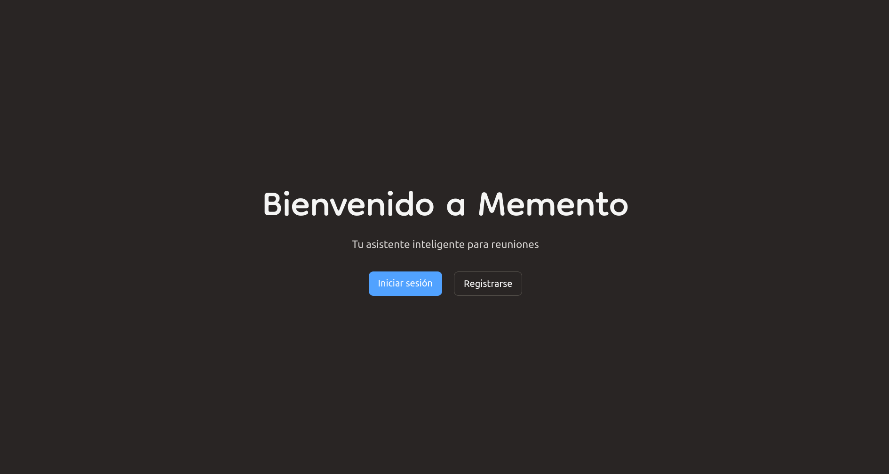
*Figura 1: Vista inicial de la aplicación.*

Se abrirá el formulario de inicio de sesión, donde puedes introducir tu correo electrónico y contraseña.

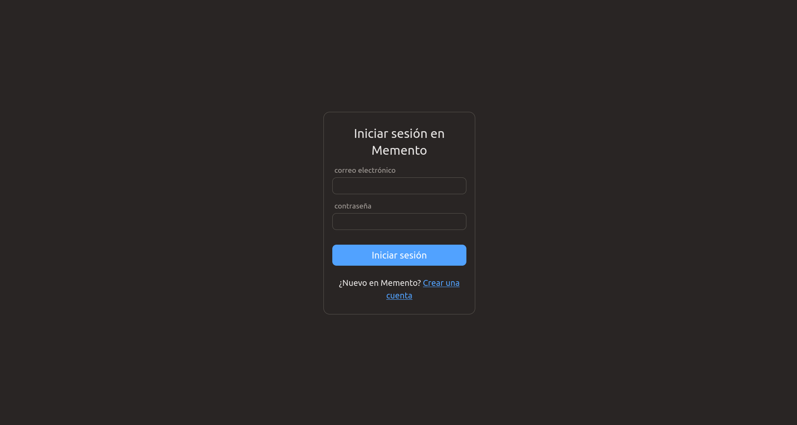
*Figura 2: Formulario de inicio de sesión.*

### 1.2 Crear una cuenta

Si no tienes cuenta, haz clic en *Registrarse* desde la vista inicial.

*Figura 3: Botón de registro en la vista inicial.*

En el formulario de registro, introduce tu correo electrónico y una contraseña (deberás confirmarla dos veces). Una vez completado, serás redirigido a la vista principal de la aplicación.

## 2. Reuniones

La gestión de reuniones es la funcionalidad principal de Memento. Las reuniones se crean subiendo archivos de audio; el sistema las procesa automáticamente para generar su transcripción y un resumen estructurado. Una vez procesadas, puedes consultar su contenido, editar sus metadatos o eliminarlas.

### 2.1 Subir una grabación

Para subir una o varias grabaciones, haz clic en *Subir reuniones* en el panel lateral.
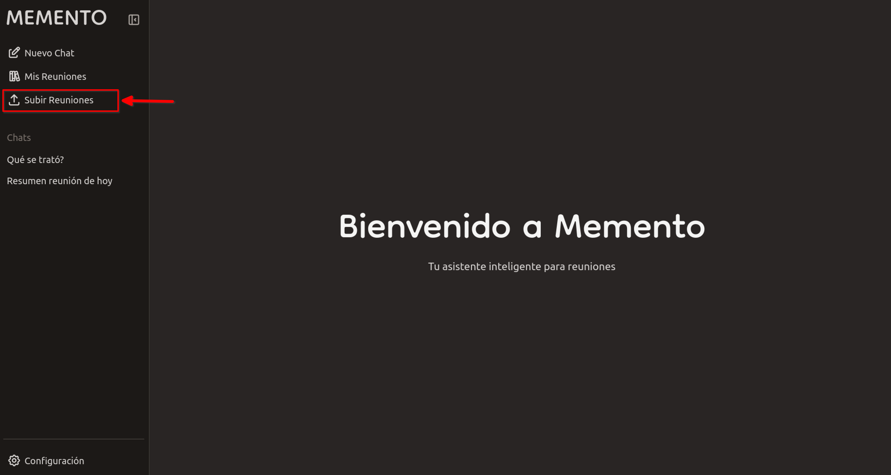
*Figura 4: Panel lateral con la opción "Subir reuniones".*

Se abrirá el modal de subida. Para cada reunión debes indicar:

- **Título:** un nombre para identificar la reunión.
- **Fecha:** la fecha de la reunión (por defecto, la de hoy).
- **Archivo:** el archivo de audio a procesar.

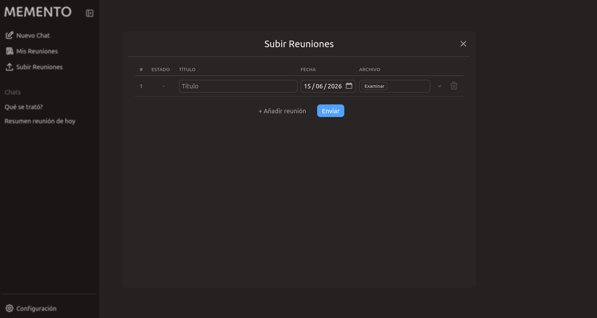
*Figura 5: Modal de subida de reuniones.*

Opcionalmente, puedes hacer clic en el botón situado a la derecha del selector de archivo para indicar el **idioma** de la reunión y el **número de hablantes**.

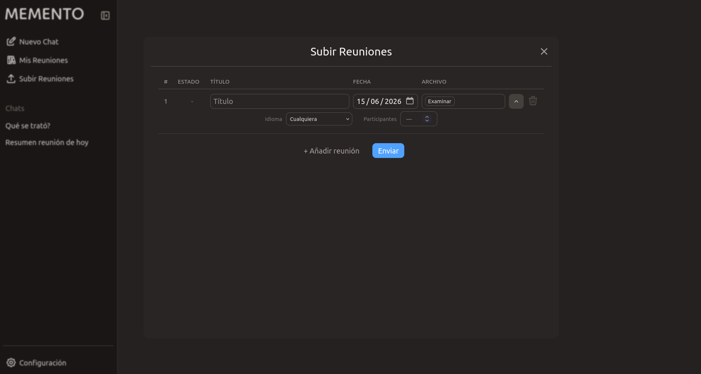
*Figura 6: Opciones adicionales: idioma y número de hablantes.*

Si quieres subir más de una reunión, haz clic en *+ Añadir reunión* tantas veces como necesites.

Cuando hayas completado el formulario, haz clic en *Enviar* para iniciar el procesamiento. La columna *Estado* muestra indicadores visuales del progreso:

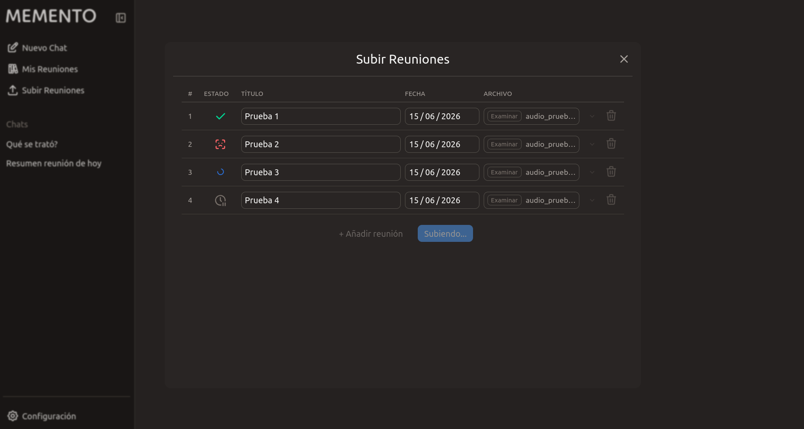
*Figura 7: Estados de procesamiento: procesado con éxito, error, procesando y pendiente.*

Una vez finalizado el proceso, el formulario se actualiza mostrando únicamente las reuniones que no pudieron procesarse correctamente, para que puedas reintentarlo si lo deseas.

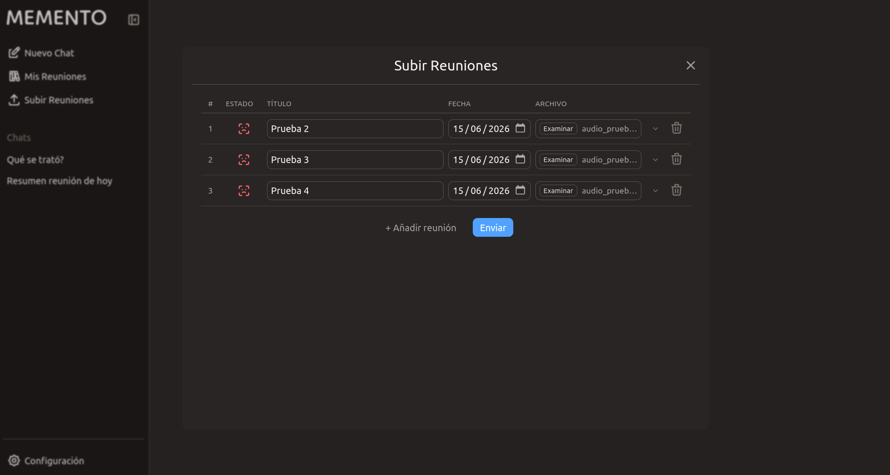
*Figura 8: Reuniones que no se procesaron correctamente.*

### 2.2 Lista de reuniones

Para ver tus reuniones procesadas, haz clic en *Mis Reuniones* en el panel lateral.

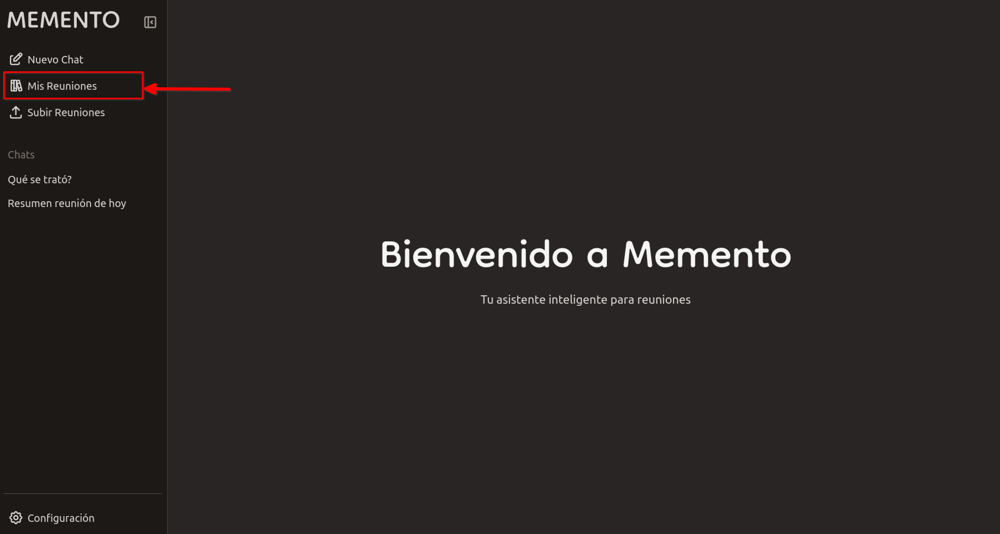
*Figura 9: Panel lateral con la opción "Mis Reuniones".*

Se mostrará la lista de todas tus reuniones con su título, fecha y estado.

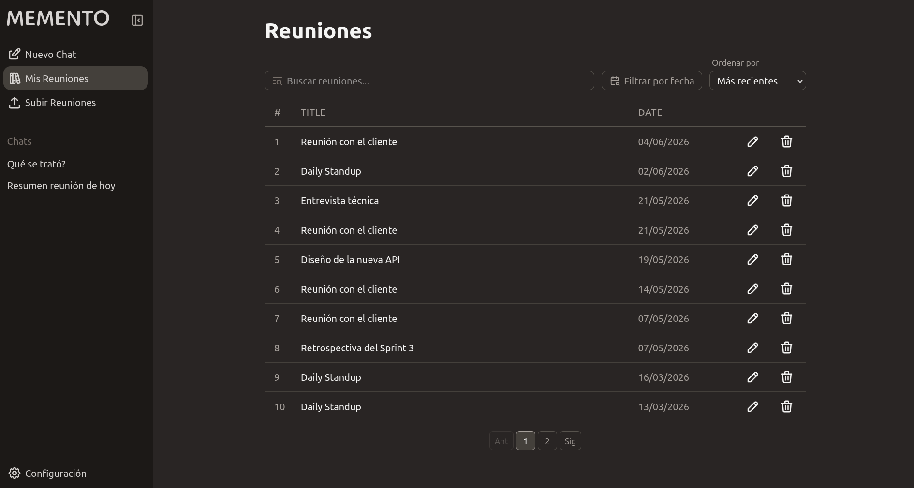
*Figura 10: Lista de reuniones.*

Puedes buscar reuniones introduciendo texto en el buscador, que filtra por título. También puedes acotar las reuniones por fecha haciendo clic en *Filtrar por fecha* y seleccionando un rango; la lista se actualizará automáticamente. Para eliminar los filtros de fecha, haz clic en *Limpiar*.

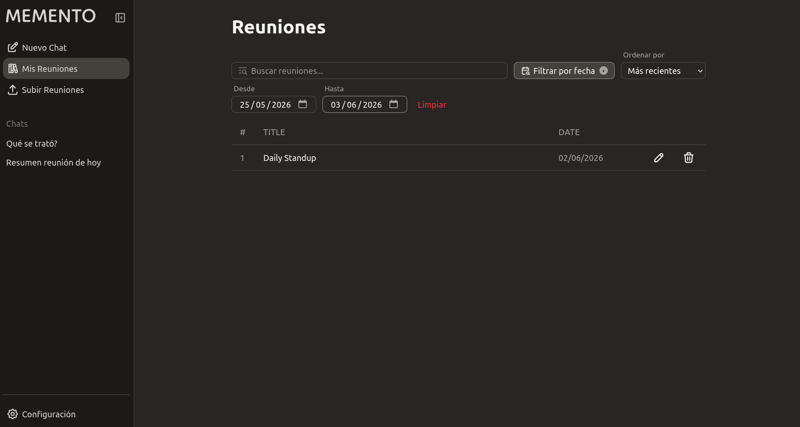
*Figura 11: Filtro por rango de fechas.*

Para cambiar el orden de las reuniones, usa el desplegable y selecciona el criterio deseado.

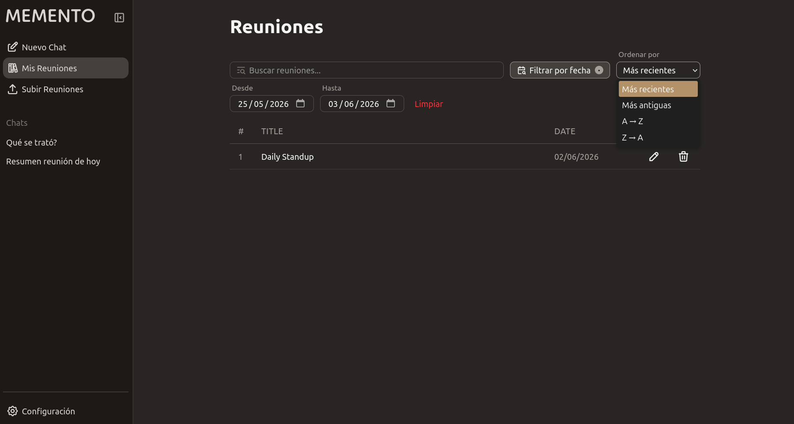
*Figura 12: Desplegable de ordenación.*

### 2.3 Consultar transcripción y resumen

Para ver los detalles de una reunión, haz clic sobre su título en la lista.

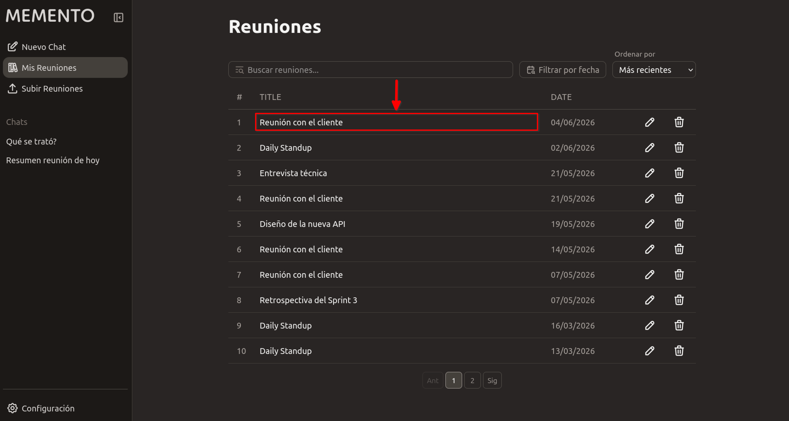
*Figura 13: Acceso a los detalles de una reunión.*

Se abrirá la vista de transcripción, donde puedes leer el contenido completo de la reunión.

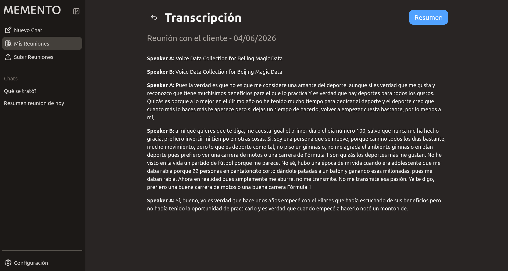
*Figura 14: Vista de transcripción de la reunión.*

Haciendo clic en la pestaña *Resumen*, puedes consultar el resumen estructurado generado automáticamente.

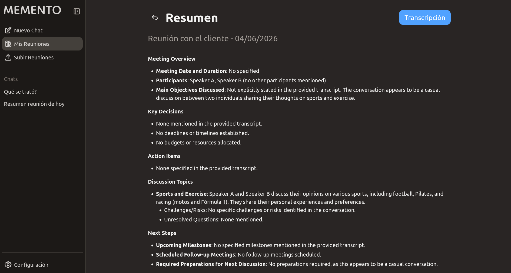
*Figura 15: Vista del resumen de la reunión.*

### 2.4 Editar metadatos

Desde la lista de reuniones, haz clic en el botón de editar de la reunión que quieras modificar.

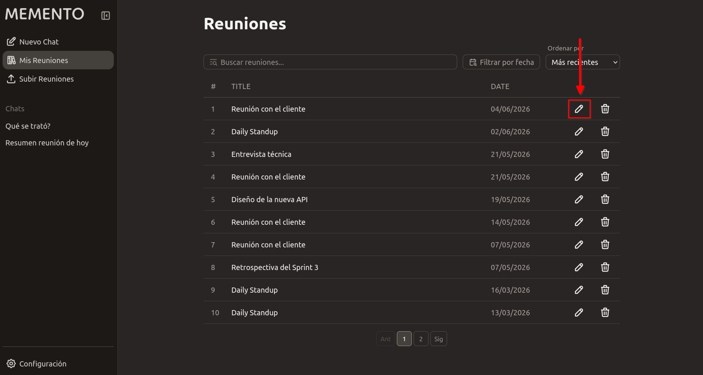
*Figura 16: Botón de editar en la lista de reuniones.*

Se habilitará el modo de edición, que te permite modificar el título y la fecha de la reunión.

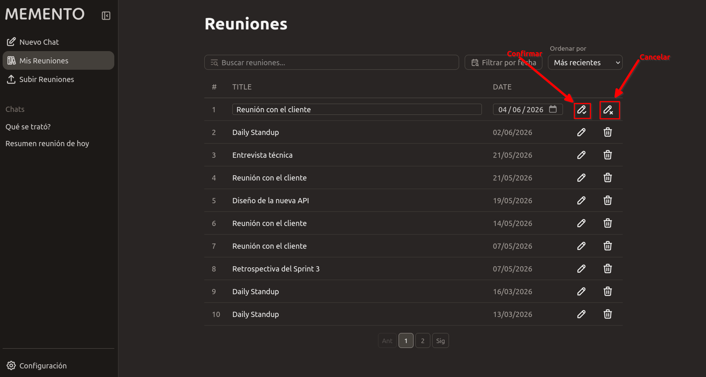
*Figura 17: Modo de edición de metadatos.*

Para confirmar los cambios, haz clic en el botón de confirmar. Si quieres descartarlos, haz clic en el botón de cancelar.

### 2.5 Eliminar una reunión

Desde la lista de reuniones, haz clic en el botón de eliminar de la reunión correspondiente.

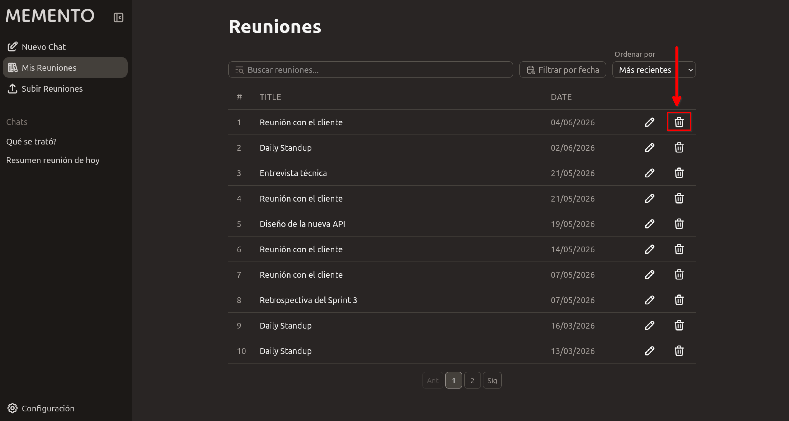
*Figura 18: Botón de eliminar en la lista de reuniones.*

Aparecerá un modal de confirmación. Haz clic en *Eliminar* para borrar la reunión definitivamente.

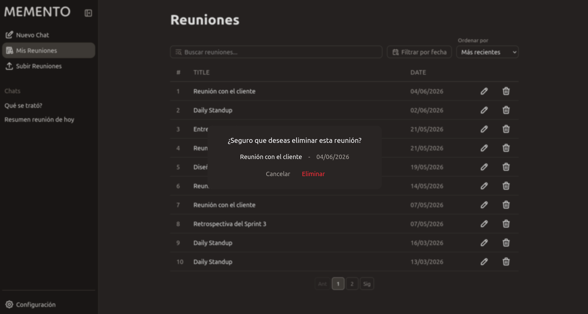
*Figura 19: Modal de confirmación de eliminación.*

## 3. Chat

El chat te permite hacer preguntas en lenguaje natural sobre el contenido de tus reuniones. El asistente utiliza los resúmenes de tus reuniones como contexto para generar respuestas.

### 3.1 Realizar una consulta

Desde el panel lateral puedes navegar a la vista de chat. Tienes dos opciones:

- **Nueva conversación:** para iniciar un chat desde cero.
- **Conversación existente:** para reanudar un chat anterior.

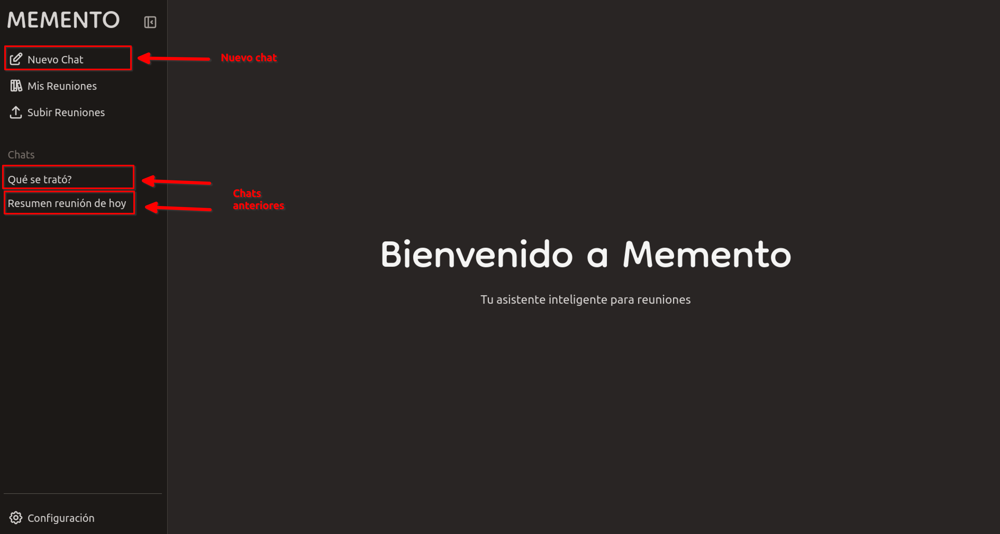
*Figura 20: Sección de chat en el panel lateral.*

Si eliges *Nueva conversación*, verás una vista con un campo de texto donde puedes escribir tu consulta y enviarla con el botón o presionando Enter.

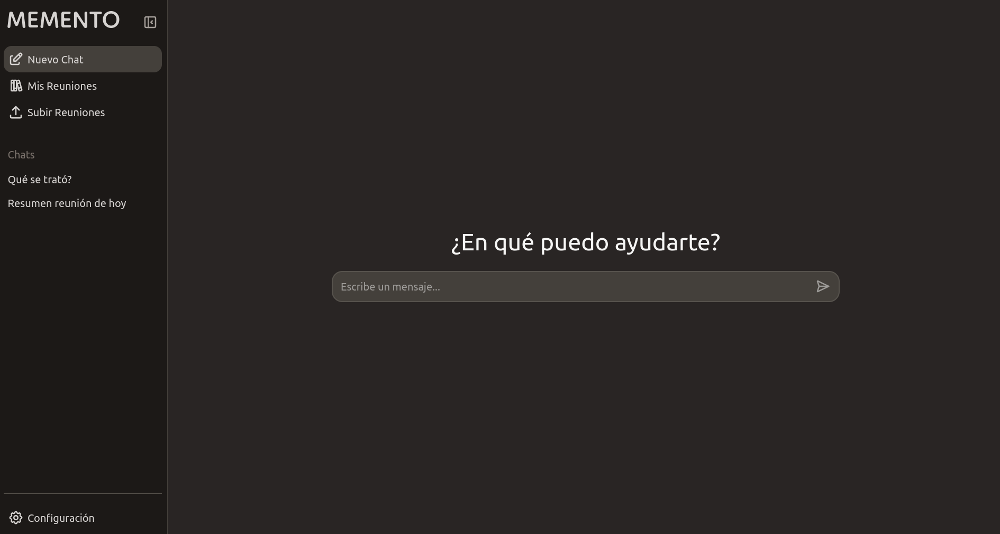
*Figura 21: Vista de nueva conversación.*

Si seleccionas una conversación existente, verás el historial de mensajes y podrás continuar la conversación de la misma forma.

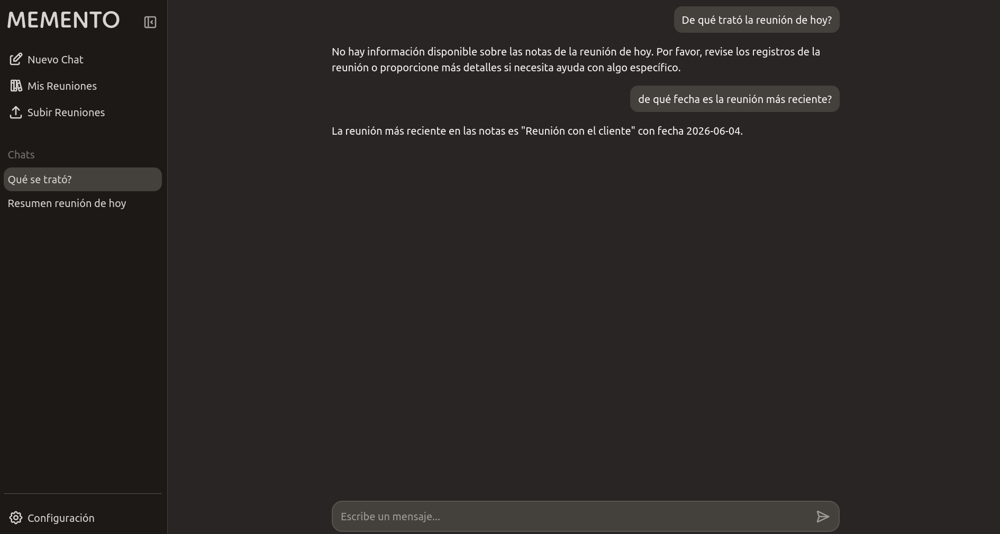
*Figura 22: Vista de una conversación existente.*

### 3.2 Gestionar el historial de conversaciones

Las conversaciones se listan en el panel lateral. Para gestionarlas, sitúa el cursor sobre una conversación y aparecerá un botón de opciones.

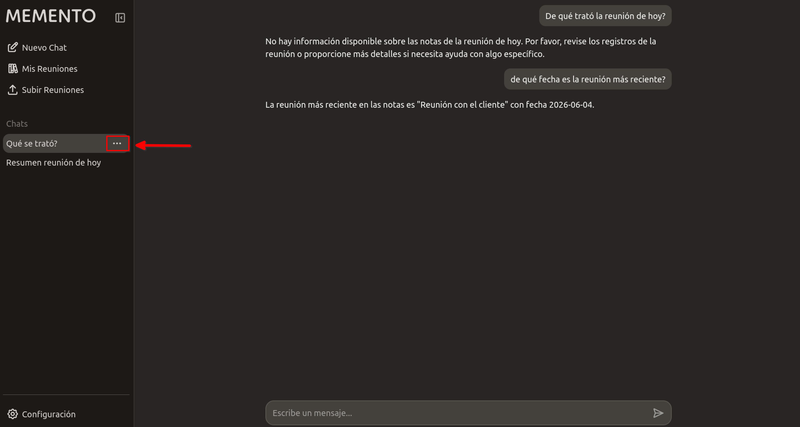
*Figura 23: Botón de opciones al pasar el cursor sobre una conversación.*

Al hacer clic, se despliega un menú con las siguientes acciones:

- **Renombrar:** cambia el nombre de la conversación.
- **Eliminar:** borra la conversación definitivamente.

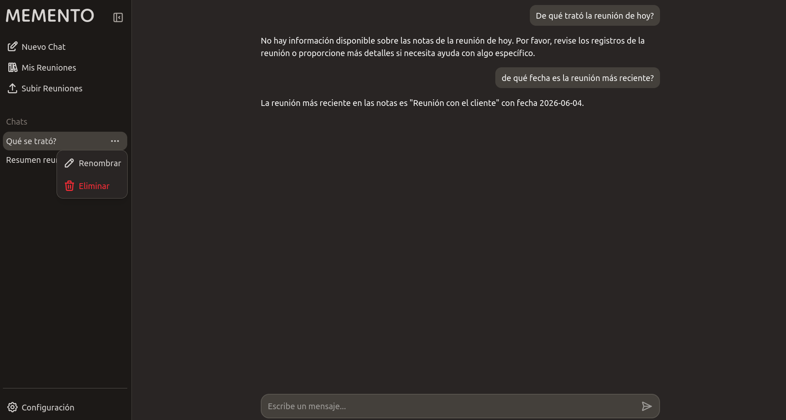
*Figura 24: Menú de opciones de una conversación.*

## 4. Ajustes

El modal de ajustes centraliza todas las opciones de configuración de la aplicación. Para abrirlo, haz clic en el botón de configuración del panel lateral.

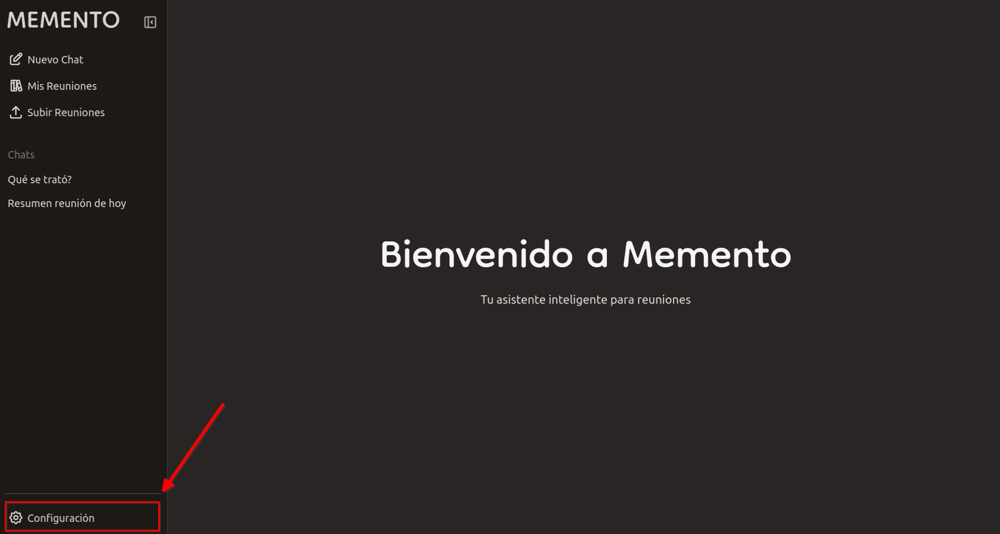
*Figura 25: Botón de configuración en el panel lateral.*

### 4.1 Preferencias generales

La pestaña *General* te permite modificar:

- **Tema:** claro, oscuro o automático (según el sistema).
- **Idioma:** idioma de la interfaz.
- **Elementos por página:** número de reuniones mostradas por página en la lista.

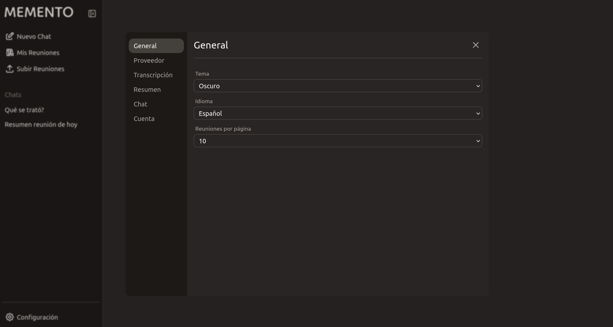
*Figura 26: Ajustes generales de la aplicación.*

### 4.2 Plantilla de resumen

En la pestaña *Resumen* puedes visualizar y editar la plantilla que se utiliza para generar los resúmenes de las reuniones. Si has modificado la plantilla y quieres volver a la original, puedes usar el botón *Restaurar plantilla por defecto*.

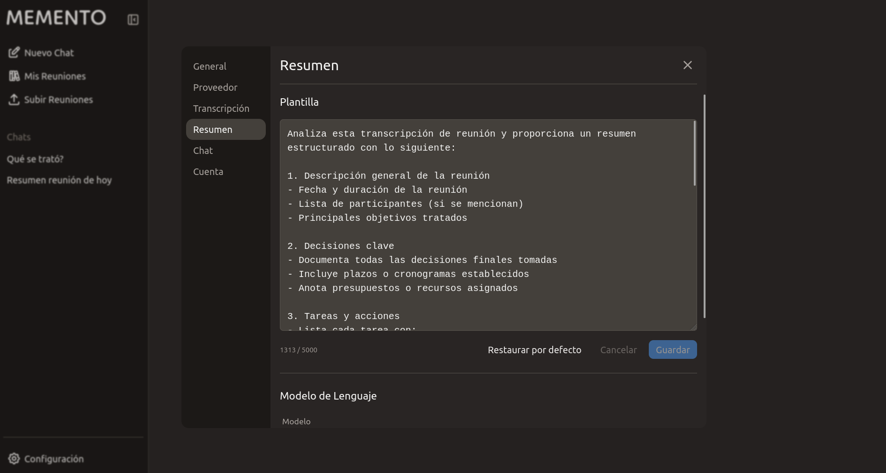
*Figura 27: Ajustes de la plantilla de resumen.*

### 4.3 Proveedores y claves API

En la pestaña *Proveedores* se muestran los proveedores de modelos de lenguaje disponibles (Ollama, OpenAI y Anthropic). Para usar los modelos de un proveedor, necesitas añadir tu clave API.

Haz clic en *Añadir clave API* e introduce la clave en el formulario.

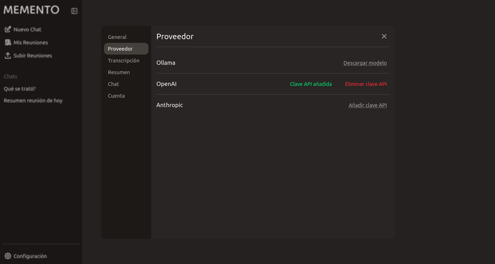
*Figura 28: Lista de proveedores con botón para añadir clave API.*

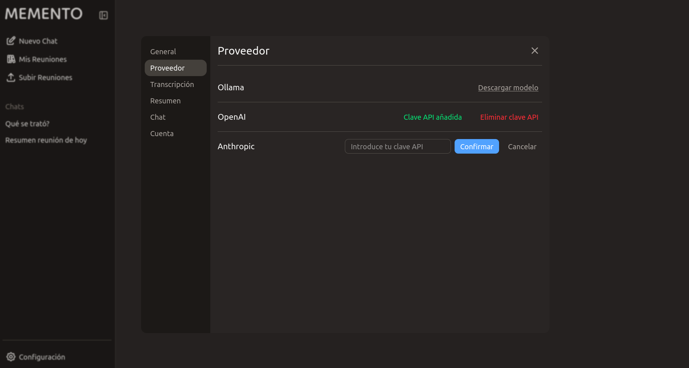
*Figura 29: Formulario para añadir una clave API.*

Para eliminar una clave que ya has añadido, haz clic en *Eliminar clave API*.

### 4.4 Modelos de lenguaje

Las pestañas *Chat* y *Resumen* te permiten seleccionar el modelo de lenguaje a utilizar en cada caso, así como ajustar dos hiperparámetros:

- **Temperatura:** controla la creatividad de las respuestas (valores más altos producen respuestas más variadas).
- **Tokens máximos:** limita la longitud máxima de la respuesta generada.

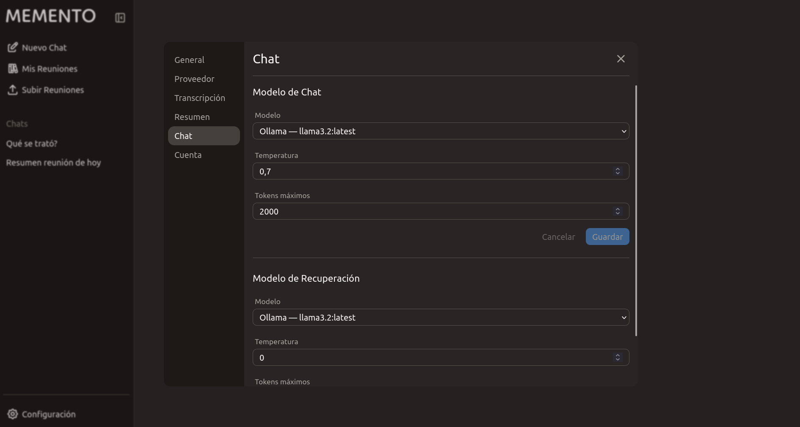
*Figura 30: Configuración del modelo para el chat.*

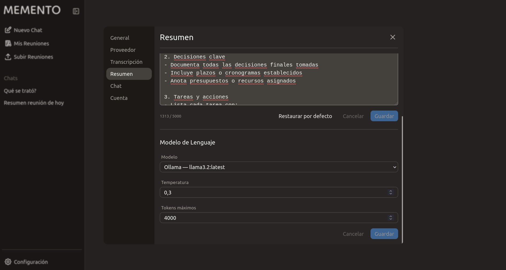
*Figura 31: Configuración del modelo para el resumen.*

### 4.5 Cuenta

La pestaña *Cuenta* muestra el correo electrónico con el que has iniciado sesión y ofrece las siguientes opciones:

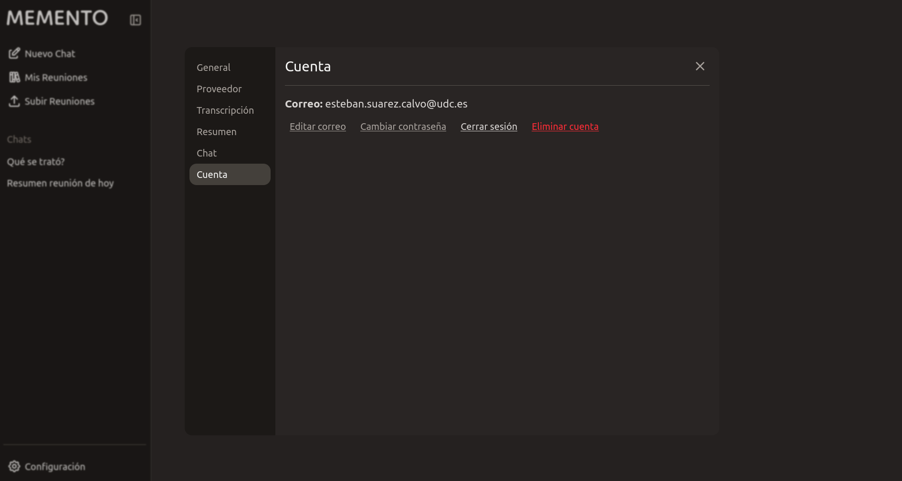
*Figura 32: Ajustes de cuenta.*

**Editar correo electrónico.** Haz clic en *Editar correo*, introduce el nuevo correo y tu contraseña actual para confirmar el cambio.

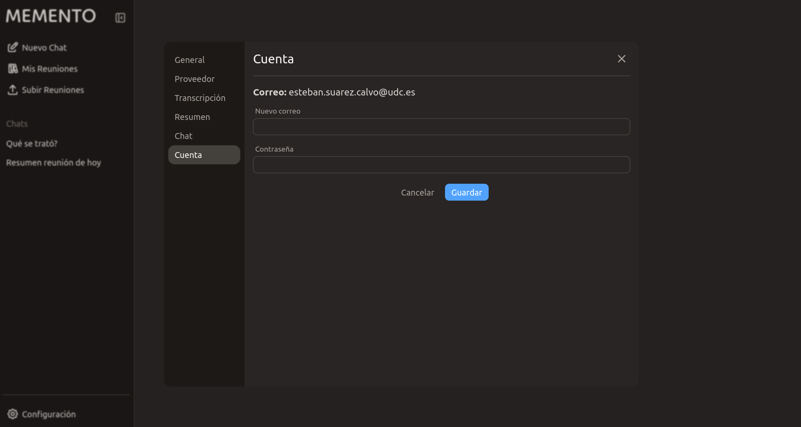
*Figura 33: Formulario de edición de correo electrónico.*

**Modificar contraseña.** Haz clic en *Modificar contraseña*, introduce tu contraseña actual y la nueva (debes confirmarla dos veces).

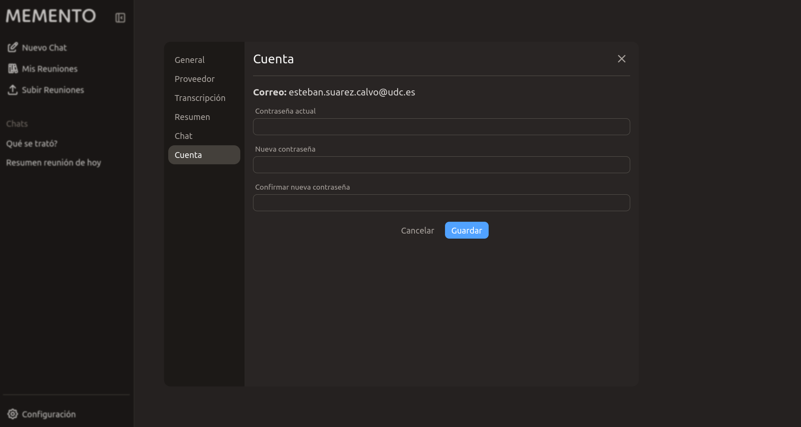
*Figura 34: Formulario de cambio de contraseña.*

**Eliminar cuenta.** Haz clic en *Eliminar cuenta*, lee el aviso sobre el periodo de conservación de datos e introduce tu contraseña para confirmar la eliminación.

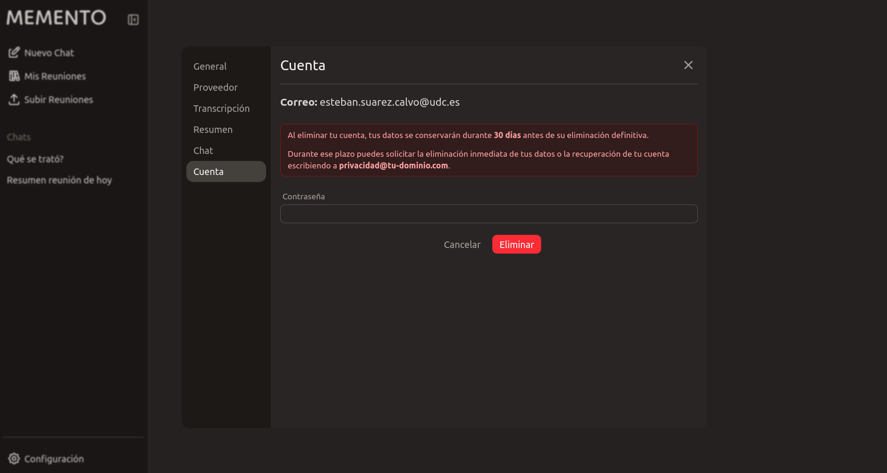
*Figura 35: Formulario de eliminación de cuenta.*
